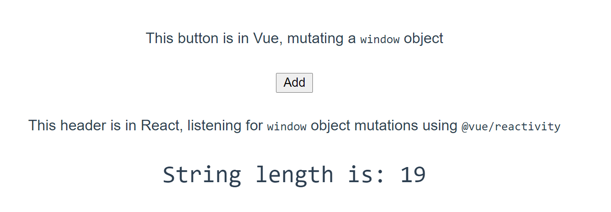

# React + Vue 3 Data Sharing

This project is an example of rendering a `window` object in React that's mutated from Vue.

The Vue component lives: [here](./src/App.vue)

The React component lives: [here](./src/Test.js)